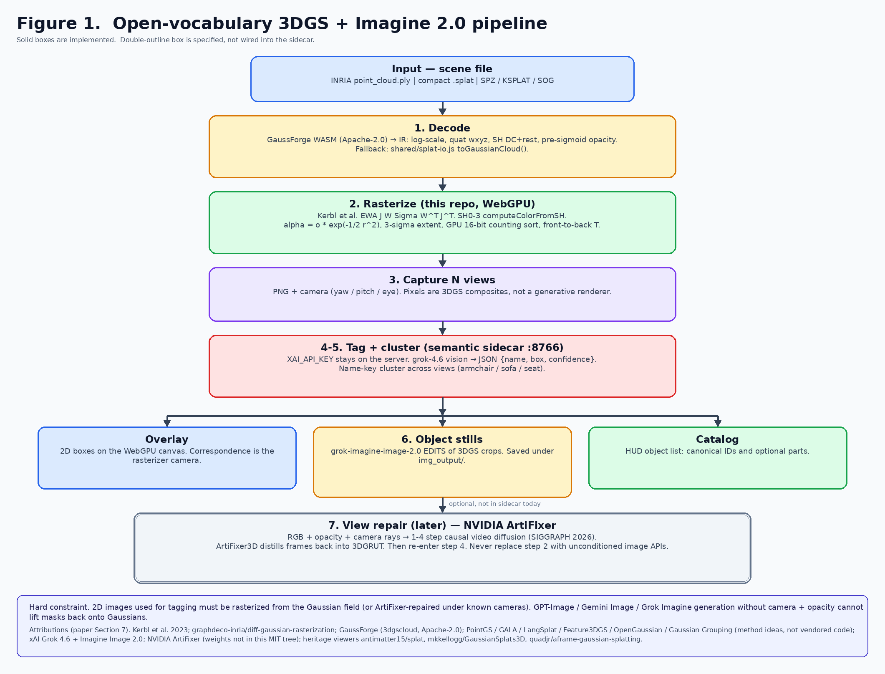
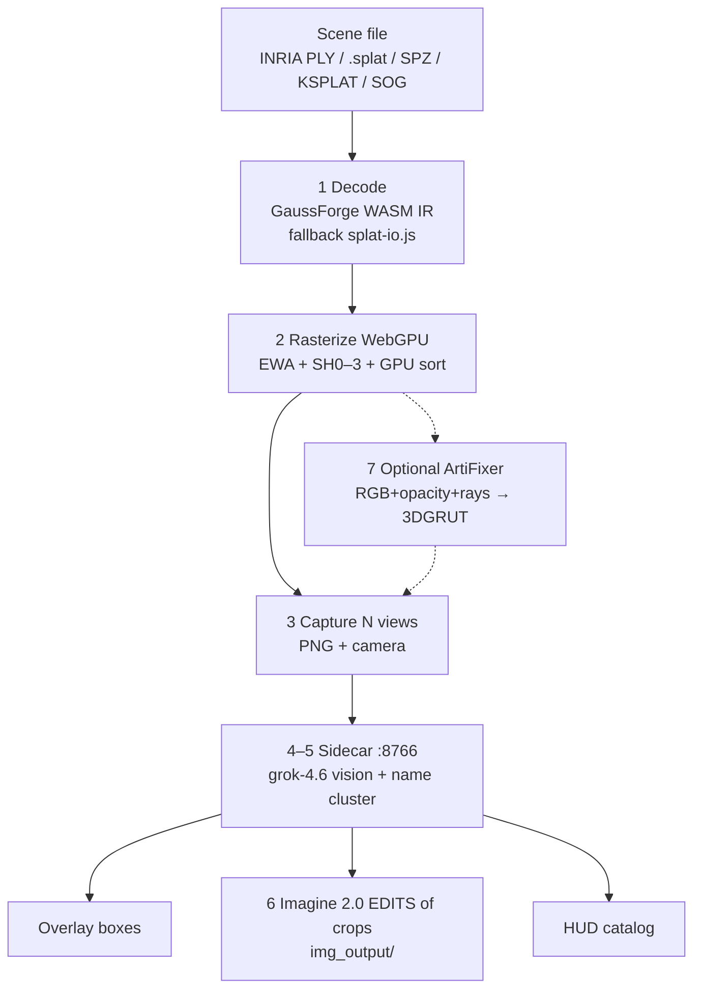
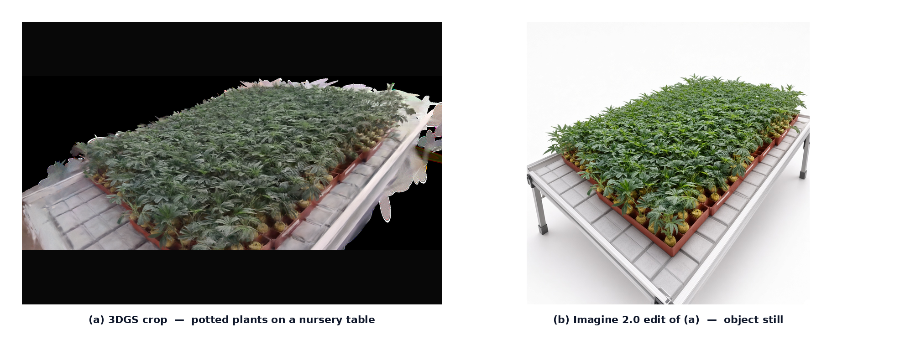
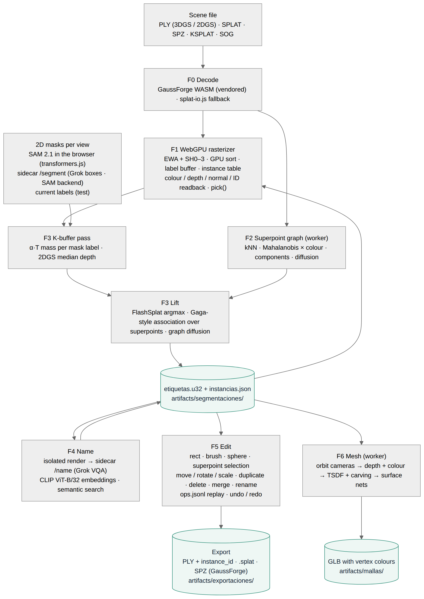

# Open-Vocabulary Tagging and Object Still Generation from Browser 3D Gaussian Splatting

**Technical report · implementation note**  
Gaussian Splatting Web Viewers — WebGPU path  
2 September 2026 · revised 3 September 2026 (Section 6: per-Gaussian segmentation, editing and meshing, plan F0–F6)

PDF: [open-vocab-3dgs-imagine-pipeline-paper.pdf](open-vocab-3dgs-imagine-pipeline-paper.pdf) · operator notes: [pipeline.md](pipeline.md)

---

## Abstract

This report describes a *modular* pipeline that (i) loads a 3D Gaussian Splatting (3DGS) scene in the browser, (ii) rasterizes it with a WebGPU implementation of the Kerbl et al. image-formation model, (iii) captures calibrated 2D views, (iv) tags those views with a vision–language model, and (v) produces object stills with an image-edit API. The design follows the 2D-lift paradigm of PointGS, GALA, and LangSplat: **language is applied to images that are composites of known Gaussians under known cameras**, not to unconditioned text-to-image samples. Grok Imagine Image 2.0 is used only as an *edit* of 3DGS crops. NVIDIA ArtiFixer is specified as an optional later stage for repairing off-trajectory views. This document is an implementation note for the `Gaussian-Splatting-WebViewers` repository; it is not a claim of new reconstruction metrics.

**Keywords:** 3D Gaussian Splatting, WebGPU, open-vocabulary tagging, Grok Imagine, GaussForge, ArtiFixer

---

## 1. Introduction

3D Gaussian Splatting [1] represents a scene as anisotropic 3D Gaussians and rasterizes them with EWA splatting [2] and spherical-harmonic view-dependent color. Official training output is an INRIA `point_cloud.ply` (float covariance, SH degree 3). Compact `.splat` files [6] discard SH rest bands and quantize rotations.

Browser viewers historically packed everything to 32-byte rows and looked like point clouds. This project’s WebGPU viewer keeps float Gaussians and SH0–3. On top of that rasterizer we add a **local sidecar** that:

1. Tags captured 3DGS frames with **Grok 4.6 vision**.
2. Clusters tags across views by a normalized name key.
3. Calls **Grok Imagine Image 2.0** to edit 3DGS crops into object cards, stored under `img_output/`.

The scientific constraint, taken from PointGS [10] and related open-vocab 3DGS work [11–15], is:

> Pixels used for semantics must be produced by the Gaussian image-formation model (or a camera-conditioned repair of it). Unconditioned image generators cannot back-project a mask onto Gaussian index \(i\).

---

## 2. Related work (what we reuse vs. what we do not ship)

Table 1 distinguishes methods whose *equations or formats* are in the running system from methods whose *ideas* informed the pipeline but whose code is not vendored. Section 8 lists licenses.

| Line of work | Role in this pipeline |
| --- | --- |
| Kerbl et al. 3DGS [1] and `diff-gaussian-rasterization` [3] | Image formation, SH eval, 3-sigma Gaussian, \(\alpha = o\exp(-\tfrac12 r^2)\) |
| Zwicker EWA [2] | Screen-space covariance \(J W \Sigma W^\top J^\top\) |
| PointGS [10] | Sparse cloud → 3DGS → SAM on *renders* → distill → kNN back to points. We reuse the **render-then-tag** idea, not their CUDA training |
| GALA [11], LangSplat [12], Feature3DGS [13], OpenGaussian [14], Gaussian Grouping [15] | Open-vocab / instance fields on 3DGS. Not vendored |
| ReferSplat [16] | Referring segmentation (sentence → 3D mask). Different product; not implemented |
| NVIDIA ArtiFixer [17, 18] | Optional camera+opacity video repair. Weights are NVIDIA noncommercial; not in the MIT tree |
| NVIDIA Fixer / Difix3D+ [19] | Distinct single-step *image* model; do not confuse with ArtiFixer |
| GaussForge [4] | Multi-format decode IR (PLY, SPLAT, SPZ, KSPLAT, SOG) |
| antimatter15/splat [6], Kellogg GaussianSplats3D [7], quadjr/aframe-gaussian-splatting [8] | Heritage WebGL viewers and 32-byte layout |
| xAI Grok vision + Imagine Image 2.0 [20, 21] | Tagging and object-card *edits* |

---

## 3. System overview

Default scene: `splats/model.splat` (compact 32-byte SH0, ~401k Gaussians). Serve the **repository root** on port 8090 so the worker can import `../shared/splat-io.js`. The sidecar on 8766 reads `XAI_API_KEY` from the repo-root `.env`. The browser never sees API keys.

### 3.1 Flowchart



*Figure 1. End-to-end workflow. Solid boxes are implemented. ArtiFixer (double outline) is specified but not wired into the sidecar.*



### 3.2 Stages

| Stage | Input | Output | Engine | Code |
| --- | --- | --- | --- | --- |
| 1 Decode | Bytes + filename | `gaussians` \(N\times12\), `sh` \(N\times48\) | GaussForge; fallback `toGaussianCloud` | `parse-worker.js`, `shared/splat-io.js` |
| 2 Rasterize | Float cloud | Premultiplied framebuffer | WebGPU, Kerbl image formation | `gpu-renderer.js` |
| 3 Capture | Current / orbit cameras | PNG + yaw/pitch/eye | `snapshotPng` | `main.js` |
| 4 Tag | PNG | `{name, box, confidence, parts}` | `grok-4.6` vision | `semantic_sidecar/server.py` |
| 5 Cluster | Per-view tags | Canonical objects | Normalized name key | same |
| 6 Cards | Crop of `best_box` | Studio still | `grok-imagine-image-2.0` **edits** | same; files in `img_output/` |
| 7 Repair (later) | RGB, opacity, rays | Repaired video / 3DGRUT | NVIDIA ArtiFixer | not in sidecar |

---

## 4. Rasterizer (stage 2)

The WebGPU path does **not** pack to 32-byte rows for drawing. Each Gaussian is `pos, opacity, scale, quat(wxyz)` plus 16 RGB SH coefficients.

Following [1, 3]:

- Covariance \(\Sigma = R S S^\top R^\top\).
- EWA 2D covariance from Jacobian \(J\) of the projective map and view rotation \(W\).
- Color from `computeColorFromSH` (SH_C0…SH_C3), then \(+0.5\), \(\max(0,\cdot)\).
- Extent \(3\sqrt{\lambda}\) (paper 3-sigma).
- Fragment \(\alpha = \min(0.99,\; o\cdot\exp(-\tfrac12 r^2))\).
- Front-to-back transmittance with blend `(oneMinusDstAlpha, one)` and clear alpha 0.

Compact `.splat` still only recovers SH0; the HUD warns. Full radiance field requires INRIA `point_cloud/iteration_*/point_cloud.ply` with `f_rest_0…44`.

Counting sort is a 16-bit GPU histogram + prefix sum + scatter (near first). It is not copied from a named third-party WebGPU 3DGS engine.

---

## 5. Semantic sidecar (stages 4–6)

The browser never holds API keys. It POSTs PNG captures to `http://127.0.0.1:8766`.

- **Vision:** `POST https://api.x.ai/v1/chat/completions` model `grok-4.6`, image + JSON schema prompt. Fallback `POST /v1/responses`.
- **Cluster:** lowercase alphanumeric key; merge “armchair / green sofa / seat” by string identity (not CLIP [9]; a later upgrade).
- **Imagine:** `POST https://api.x.ai/v1/images/edits` model `grok-imagine-image-2.0`, `response_format: b64_json`. Prompt asks for a photoreal product still of the **reference crop**. This is image-to-image, not text-to-image from nothing.
- **Library:** `img_output/YYYYMMDD-HHMMSS-name/{source.png, imagine.jpg, meta.json}` plus `img_output/index.jsonl`.

A demo crop of potted plants on a nursery table (Figure 2) was rasterized in the WebGPU viewer and edited with Imagine 2.0. Files: `img_output/20260902-164810-potted-plants/`.



*Figure 2. (a) WebGPU 3DGS crop of potted plants on a nursery table. (b) Grok Imagine Image 2.0 edit of that crop. The still is an illustration of the tagged object, not a measurement of the Gaussian field.*

---

## 6. Per-Gaussian segmentation, editing and meshing (plan F0–F6)

The tagging pipeline of Sections 3–5 labels *views*. The segmentation plan [`plan-segmentacion-edicion-3dgs.md`](plan-segmentacion-edicion-3dgs.md) adds per-Gaussian instances, editing and meshing on top of the same rasterizer, without any per-scene training. Figure 3 shows the data flow; Table 6.1 the stages; Table 6.2 the measured results.



*Figure 3. Everything runs in the browser (WebGPU passes and Web Workers); the sidecar only calls xAI for names and persists files under `artifacts/`. Source `figures/segmentation-pipeline.mmd`.*

### 6.1 Stages

| Phase | Method | Code |
| --- | --- | --- |
| F0 Base | GaussForge vendored (offline decode, CDN fallback), 2DGS PLY, `artifacts/`, Node + Playwright test harness (offscreen rendering under SwiftShader) | `vendor/gaussforge/`, `shared/splat-io.js`, `tests/` |
| F1 Identity | `u32` label per Gaussian and a 4096-entry instance table (rigid/affine transform, tint, visible/selected) read in the vertex shader; output modes colour / alpha-weighted mean depth / normal / ID with offscreen readback; `pick()` from the ID pass | `gpu-renderer.js` |
| F2 Superpoints | kNN graph (k = 10, hash grid sorted by cell), symmetric Mahalanobis distance × SH0 colour weights, threshold, connected components → superpoints; weighted-majority label diffusion over the graph | `shared/graph.js` in a worker |
| F3 Lift | K-buffer fragment pass storing (index, α, depth) per pixel with exact overflow handling (chunked depth-sorted draw), compute resolve that carries transmittance and the exact 2DGS median depth [22]; per-Gaussian α·T mass per mask label → FlashSplat closed-form argmax with a background bias [23]; Gaga-style association across views by containment of superpoint histograms [24]; LUDVIG-style graph diffusion [25]; export `instancias.json` + `etiquetas.u32` | `contrib-pass.js`, `shared/lift.js` |
| Masks | SAM 2.1 hiera-tiny in the browser (transformers.js + ONNX Runtime Web, WASM or WebGPU) prompted by projected superpoint centroids with duplicate-mask merging [26]; or the sidecar (`/segment`: Grok boxes rasterised as ellipses, pluggable SAM backend) | `ml-browser.js`, `semantic_sidecar/server.py` |
| F4 Name | Isolated render per instance (camera framed on its bounds, only its Gaussians) → `/name` Grok VQA with a Spanish JSON schema; CLIP ViT-B/32 image/text embeddings in the browser for semantic search [27]; Imagine card per `id_instancia` | `shared/naming.js`, `ml-browser.js` |
| F5 Edit / export | Selection on the ID buffer (rectangle, brush, 3D sphere, superpoint), reproducible `ops.jsonl` (assign, transform, delete, duplicate, merge, rename) with undo by replay, transforms baked at export; PLY with `instance_id` / `class_id` / `confidence`, `.splat`, SPZ and compressed PLY through GaussForge; a reloaded PLY restores its instances | `shared/edit-ops.js`, `shared/export-io.js` |
| F6 Mesh | Fibonacci-sphere orbit around the isolated instance → depth (mean, or 2DGS median) + colour → truncated signed distance fusion with empty-space carving [28, 29] → naive surface nets [30, 31] → largest component → GLB 2.0 with normals and vertex colours | `shared/tsdf.js` in a worker, `shared/glb.js` |

The invariant identifier is the Gaussian index in the source file; labels, selections, exports and duplicates (`origen`) are expressed on it, and every `instancias.json` is validated against `shared/schemas/instancias.schema.json`.

### 6.2 Results (container with 4 vCPU, no GPU: WebGPU on SwiftShader, ONNX on WASM)

| Measurement | Synthetic two spheres (4 000 Gaussians) | `alarm_clock_generated.splat` (262 144 Gaussians) |
| --- | --- | --- |
| F1 depth error at the sphere centre | 0.0 % (analytic front surface) | — |
| F2 graph | 2 superpoints in 109 ms | 113 154 superpoints in 3.0–3.8 s (threshold 0.3 is too fine for real scenes) |
| F3 K-buffer | exact: 0 mis-assigned Gaussians from one view | ≈ 35 s per view at 512 px (≈ 670 chunks; ~100 fragments per pixel) |
| F3 lift, test masks | 6 permuted views → 2 instances, 3D IoU 0.9985 / 1.0 (1.0 / 1.0 after diffusion) | — |
| Masks, Grok boxes | — | 1 coarse box per view → 5 fragments, 0 cross-view merges |
| Masks, SAM 2.1 in the browser | 2 views → exactly 2 instances of 2 000 Gaussians; encode ≈ 21 s/view, decode 0.4 s | coherent parts (body, face, hands, bell, legs, button; scores 0.73–0.97); 12 of 31 duplicate masks merged; 17 instances with only 2 cross-view merges |
| F4 Grok naming | "esfera naranja" 0.92 in 12.6 s; Imagine card 7.7 s | "reloj analógico" 0.72 for the largest instance |
| F4 CLIP | "an orange ball" / "a blue sphere" rank the right sphere | similarities flat (0.20–0.24) on fragments |
| F5 | export instance → reload shows only that object; `ops.jsonl` replay reproduces the fingerprint | 4 986-Gaussian selection moved in 7 ms, SPZ 70 KB in 57 ms; whole scene SPZ 3.7 MB in 1.7 s; undo 0.3 s |
| F6 | closed mesh, mean radius 0.535–0.545 for r = 0.5 (+7–9 %, splat extent), 12–16 views in 7–15 s | whole clock: 24 views, 96³ voxels → 12 425 vertices / 24 866 triangles, 0.75 MB GLB; render 374 s (SwiftShader), fusion 0.8 s, extraction 0.1 s |

Tests: 107 Node unit tests and 22 Playwright tests (plus one opt-in test that runs SAM 2.1 and CLIP in the browser) cover every phase; see [testing.md](testing.md).

### 6.3 Deviations from the plan and open items

- Meshing runs in JavaScript (TSDF + surface nets) instead of Open3D in the sidecar: it works offline and without a 450 MB dependency; Open3D and Poisson remain optional backends.
- Model weights are not vendored in git; `scripts/download-ml-models.sh` fetches transformers.js, ONNX Runtime Web, SAM 2.1 and CLIP into the gitignored `vendor/ml/`. Without it the browser loads them from jsDelivr and the Hugging Face Hub.
- Cross-view association on real scenes is the weak link: with 113k tiny superpoints the same part seen from different angles often stays a separate instance. Next step: 3D-overlap association after the lift and a coarser F2 threshold.
- Vanilla 3DGS gives a noisy mesh (the HUD warns); 2DGS/GOF PLYs are recommended for production meshes. A Chamfer-distance check against a reference mesh is still pending.
- Not implemented: lasso selection, exact baking of non-uniform scales, hole filling after deletion, in-viewer mesh preview, decimation.

---

## 7. What must not be done

1. Replace stage 2 with GPT-Image, Gemini Image, or Imagine **generation**. Those APIs have no camera or opacity, so correspondence to Gaussians is lost [10].
2. Feed Imagine outputs back into SAM/VLM distillation as if they were 3DGS rasters.
3. Put `XAI_API_KEY` in `main.js`.
4. Vendor ArtiFixer 14B weights into this MIT repository (NVIDIA OneWay Noncommercial license [18]).
5. Confuse ArtiFixer [17] with nvidia/Fixer (Difix3D+) [19].

---

## 8. Attributions and licenses

This repository’s WebGL heritage and the WebGPU/semantic additions use third-party methods and software as follows. **Code copied or linked** is distinguished from **ideas only**.

### 8.1 Software used in the running system

| Component | Origin | License | How we use it |
| --- | --- | --- | --- |
| 3DGS image formation, SH basis, 3-sigma Gaussian | Kerbl et al. [1]; CUDA reference [3] (`graphdeco-inria/diff-gaussian-rasterization`) | INRIA research license on the CUDA lib; equations reimplemented in WGSL | `gpu-renderer.js` |
| Multi-format Gaussian IR | GaussForge [4] `@gaussforge/wasm` 0.6.0 | Apache-2.0 | vendored in `vendor/gaussforge/` (NOTICE.md with SHA-256), jsDelivr only as fallback; decode and SPZ / compressed PLY export |
| transformers.js 4.2 | Hugging Face [32] | Apache-2.0 | `ml-browser.js`: SAM 2.1 and CLIP in the browser; from `vendor/ml/` (gitignored, `scripts/download-ml-models.sh`) or jsDelivr |
| ONNX Runtime Web 1.26 | Microsoft | MIT | inference backend of transformers.js (WASM / WebGPU) |
| SAM 2.1 hiera-tiny (ONNX) | Meta [26]; `onnx-community/sam2.1-hiera-tiny-ONNX` | Apache-2.0 | promptable masks per view (weights downloaded, never committed) |
| CLIP ViT-B/32 (ONNX, q8) | OpenAI [27]; `Xenova/clip-vit-base-patch32` | MIT | per-instance embeddings and text queries (weights downloaded, never committed) |
| Playwright 1.56 | Microsoft | Apache-2.0 | e2e tests only (dev dependency) |
| Pillow | PIL contributors | HPND | sidecar image handling |
| redis / redis-py | Redis Ltd. | RSALv2/SSPL server (external), MIT client | `project-memory.py` index cache, isolated namespace; not part of the viewer |
| Mermaid | Mermaid contributors | MIT | figure rendering only (`scripts/render-mermaid.mjs`, not a dependency) |
| PLY / splat fallback parser | this repo `shared/splat-io.js`, layout after [6] | MIT (this repo) | Worker fallback |
| Compact 32-byte `.splat` | antimatter15/splat [6] (Kevin Kwok) | MIT | Format interop; **not** the WebGPU GPU buffer |
| Viewer 1 | quadjr/aframe-gaussian-splatting [8] | MIT | `gaussian_splatting_1/` |
| Viewer 2 | mkkellogg/GaussianSplats3D [7] | MIT | `gaussian_splatting_2_*` |
| Grok 4.6 vision, Imagine Image 2.0 | xAI API [20, 21] | xAI API terms | Sidecar only |
| Repo license | Akbar S. / forks | MIT | `LICENSE` |

### 8.2 Methods that informed the design (no code vendored)

| Method | Paper / code | Taken from it | Not taken |
| --- | --- | --- | --- |
| PointGS [10] | Song, Li, Wang, Yan, CVPR 2026, arXiv:2605.11520 | Render 3DGS then tag 2D; do not tag raw point projections | CUDA 3DGS training, SAM contrastive distillation, 2-step ICP |
| GALA [11] | Alegret, Li, Wang, Liang, Niemeyer, Gasperini, Navab, Tombari, arXiv:2508.14278 | Open-vocab 2D+3D on 3DGS; codebook/instance consistency as a *goal* | Scaffold-GS training, dual codebooks |
| LangSplat [12] | Qin, Li, Zhou, Wang, Pfister, CVPR 2024 | Distill language from 2D views of 3DGS | Autoencoder CLIP fields per Gaussian |
| Feature3DGS [13] | Zhou, Chang, Jiang, Fan, Zhu, Xu, Chari, You, Wang, Kadambi, CVPR 2024 | Feature rasterization idea | CNN feature lifting / parallel N-D rasterizer |
| OpenGaussian [14] | Wu, Meng, Li, Wu, Shi, Cheng, Zhao, Feng, Ding, Wang, Zhang, NeurIPS 2024 | Instance clustering + language | Hierarchical CUDA clustering |
| Gaussian Grouping [15] | Ye, Danelljan, Yu, Ke, ECCV 2024 | Lift 2D masks toward 3D instances | Editing GUI |
| ReferSplat [16] | He, Jie, Wang, Zhou, Hu, Li, Ding, ICML 2025 | — (different task: referring 3DGS segmentation) | Referring field training, Ref-LERF |
| ArtiFixer [17, 18] | de Lutio et al., SIGGRAPH 2026; `nvidia/ArtiFixer` | Opacity-mixing, camera-conditioned repair, 1–4 step AR video; 3DGRUT distill | Weights, Docker training |
| SPZ / Niantic GaussianCloud [5] | nianticlabs/spz | IR field meanings (log scale, pre-sigmoid alpha, SH layout) | Compression codec (via GaussForge) |
| 2D Gaussian Splatting [22] | Huang et al., SIGGRAPH 2024 | Median-depth definition used by the K-buffer resolve; 2DGS PLY reading | Training, normal consistency losses |
| FlashSplat [23] | Shen et al., ECCV 2024 | Closed-form argmax assignment of α·T mass per mask label with a background bias | CUDA implementation |
| Gaga [24] | Lyu et al., 2024 | Cross-view mask association by 3D overlap (here over superpoint histograms) | Training-based refinement |
| LUDVIG [25] | Marrie et al., 2025 | Graph diffusion of labels over Gaussian neighbours | DINOv2 feature uplifting |
| THGS / superpoint graphs | see plan §2.1 | kNN superpoint graph with Mahalanobis × colour weights, no training | Contrastive SAM re-weighting |
| SAM 2 [26] | Ravi et al., 2024 | Promptable masks per view (ONNX export by onnx-community) | Video tracking |
| CLIP [27] | Radford et al., ICML 2021 | Image/text embeddings for semantic search | Fine-tuning |
| Volumetric fusion / KinectFusion [28, 29] | Curless & Levoy 1996; Newcombe et al. 2011 | Truncated signed distance integration with weights and space carving | GPU tracking, ICP |
| Surface nets [30, 31] | Gibson 1998; Lysenko 2012 (naive surface nets) | Vertex per sign-changing voxel, quads across sign-changing edges | Dual contouring with QEF |
| SuperSplat [33] | PlayCanvas | Selection-tool UX (rectangle, brush, sphere) and per-object export formats | Its editor and file formats |

### 8.3 License compatibility (summary)

- **This MIT tree** may include GaussForge (Apache-2.0), antimatter15/Kellogg/quadjr (MIT), and a WGSL reimplementation of published 3DGS equations.
- **xAI** is a runtime service: no model weights in git.
- **ArtiFixer weights** must stay out of this repo (NVIDIA OneWay Noncommercial). Code on GitHub is Apache-2.0 but the checkpoint is not.
- **INRIA `diff-gaussian-rasterization`** is not copied; only the published forward formulas [1, 3] are reimplemented.
- **transformers.js (Apache-2.0), ONNX Runtime Web (MIT), SAM 2.1 (Apache-2.0) and CLIP ViT-B/32 (MIT)** are permissive; their weights stay out of git (`vendor/ml/` is gitignored and refilled by `scripts/download-ml-models.sh`). SAM 3 (SAM License) is not used.
- **Playwright, Mermaid** are development-time only.

---

## 9. How to run the implemented path

```bash
cd Gaussian-Splatting-WebViewers
python3 -m http.server 8090 --bind 127.0.0.1
./semantic_sidecar/launch.sh          # :8766
./gaussian_splatting_webgpu/launch-webgpu-chrome.sh
```

Default URL loads `../splats/model.splat`. In the HUD: **Tag scene (Grok)** with **Imagine 2.0 object cards** checked. Cards appear on the right and on disk under `img_output/`.

For SH3 radiance fields, drop a trained `point_cloud.ply` instead of the compact splat. Chrome / Vulkan notes: [webgpu-chrome.md](webgpu-chrome.md).

Segmentation, editing and meshing (Section 6): HUD panels **Grupos** → **Segmentación** (mask source *SAM 2 (navegador)* after `scripts/download-ml-models.sh`) → **Instancias** (naming, CLIP search) → **Edición** (selection tools, transforms, export) → **Malla** (GLB). Outputs land under `artifacts/`; the HUD walkthrough is in [pipeline.md](pipeline.md).

---

## 10. Limitations

- Compact `.splat` is SH0; Imagine stills can look sharper than the 3DGS source because the edit model *hallucinates* high-frequency texture. They are illustrations, not measurements.
- View-tag clustering (stage 5) is string-based; CLIP embeddings [27] are used only for per-instance search (F4).
- SAM 2.1 and CLIP now run in the browser (Section 6); there is still no contrastive Gaussian affinity field and no ArtiFixer GPU in this process.
- Cross-view instance association on real scenes is weak (Section 6.3); F2's default threshold over-fragments real scans.
- Timings in Section 6.2 come from SwiftShader/WASM; a real GPU is expected to be one to two orders of magnitude faster for the WebGPU passes.
- Vision may under-label blurry splat views; zoom before tagging.
- Imagine URL downloads can 403; the sidecar requests `b64_json`.

---

## References

[1] B. Kerbl, G. Kopanas, T. Leimkühler, and G. Drettakis, “3D Gaussian Splatting for Real-Time Radiance Field Rendering,” *ACM Trans. Graph.*, vol. 42, no. 4, 2023. [https://repo-sam.inria.fr/fungraph/3d-gaussian-splatting/](https://repo-sam.inria.fr/fungraph/3d-gaussian-splatting/) Code: [https://github.com/graphdeco-inria/gaussian-splatting](https://github.com/graphdeco-inria/gaussian-splatting)

[2] M. Zwicker, H. Pfister, J. van Baar, and M. Gross, “EWA Splatting,” *IEEE Trans. Visualization and Computer Graphics*, 2002.

[3] GRAPHDECO / Inria, `diff-gaussian-rasterization` (`forward.cu`: `computeColorFromSH`, `computeCov2D`, `computeCov3D`). [https://github.com/graphdeco-inria/diff-gaussian-rasterization](https://github.com/graphdeco-inria/diff-gaussian-rasterization)

[4] 3dgscloud, GaussForge, Apache-2.0. [https://github.com/3dgscloud/GaussForge](https://github.com/3dgscloud/GaussForge) WASM: `@gaussforge/wasm`

[5] Niantic, SPZ / Gaussian cloud IR. [https://github.com/nianticlabs/spz](https://github.com/nianticlabs/spz)

[6] K. Kwok, antimatter15/splat, MIT. [https://github.com/antimatter15/splat](https://github.com/antimatter15/splat)

[7] M. Kellogg, GaussianSplats3D, MIT. [https://github.com/mkkellogg/GaussianSplats3D](https://github.com/mkkellogg/GaussianSplats3D)

[8] K. Kwok and J. Kuwada, quadjr/aframe-gaussian-splatting, MIT. [https://github.com/quadjr/aframe-gaussian-splatting](https://github.com/quadjr/aframe-gaussian-splatting)

[9] A. Radford et al., “Learning Transferable Visual Models From Natural Language Supervision” (CLIP), ICML 2021.

[10] Y. Song, Q. Li, W. Wang, and Z. Yan, “PointGS: Semantic-Consistent Unsupervised 3D Point Cloud Segmentation with 3D Gaussian Splatting,” CVPR 2026. arXiv:2605.11520. [https://github.com/SebastianYIXIAO/pointGS](https://github.com/SebastianYIXIAO/pointGS)

[11] E. Alegret, K. Li, S. Wang, S. Liang, M. Niemeyer, S. Gasperini, N. Navab, and F. Tombari, “GALA: Guided Attention with Language Alignment for Open Vocabulary Gaussian Splatting,” arXiv:2508.14278, 2025.

[12] M. Qin, W. Li, J. Zhou, H. Wang, and H. Pfister, “LangSplat: 3D Language Gaussian Splatting,” CVPR 2024. arXiv:2312.16084.

[13] S. Zhou, H. Chang, S. Jiang, Z. Fan, Z. Zhu, D. Xu, P. Chari, S. You, Z. Wang, and A. Kadambi, “Feature 3DGS: Supercharging 3D Gaussian Splatting to Enable Distilled Feature Fields,” CVPR 2024. arXiv:2312.03203.

[14] Y. Wu, J. Meng, H. Li, C. Wu, Y. Shi, X. Cheng, C. Zhao, H. Feng, E. Ding, J. Wang, and J. Zhang, “OpenGaussian: Towards Point-Level 3D Gaussian-based Open Vocabulary Understanding,” NeurIPS 2024. arXiv:2406.02058.

[15] M. Ye, M. Danelljan, F. Yu, and L. Ke, “Gaussian Grouping: Segment and Edit Anything in 3D Scenes,” ECCV 2024. arXiv:2312.00732.

[16] S. He, G. Jie, C. Wang, Y. Zhou, S. Hu, G. Li, and H. Ding, “ReferSplat: Referring Segmentation in 3D Gaussian Splatting,” ICML 2025. arXiv:2508.08252. [https://github.com/heshuting555/ReferSplat](https://github.com/heshuting555/ReferSplat)

[17] R. de Lutio, T. Fischer, Y.-Y. Chang, Y. Zhang, J. Z. Wu, X. Ren, T. Shen, K. Tothova, Z. Gojcic, and H. Turki, “ArtiFixer: Enhancing and Extending 3D Reconstruction with Auto-Regressive Diffusion Models,” SIGGRAPH 2026. [https://research.nvidia.com/labs/sil/projects/artifixer/](https://research.nvidia.com/labs/sil/projects/artifixer/)

[18] NVIDIA, `nvidia/ArtiFixer` (weights: NVIDIA OneWay Noncommercial License; Wan 2.1 base: Apache-2.0). [https://huggingface.co/nvidia/ArtiFixer](https://huggingface.co/nvidia/ArtiFixer) Code: [https://github.com/nv-tlabs/artifixer](https://github.com/nv-tlabs/artifixer)

[19] NVIDIA Fixer / Difix3D+, arXiv:2503.01774. [https://huggingface.co/nvidia/Fixer](https://huggingface.co/nvidia/Fixer) — *not* ArtiFixer.

[20] xAI, Grok image understanding (`grok-4.6`). [https://docs.x.ai/docs/guides/image-understanding](https://docs.x.ai/docs/guides/image-understanding)

[21] xAI, Imagine Image 2.0 (`grok-imagine-image-2.0`), generations and edits. [https://docs.x.ai/developers/model-capabilities/images/generation](https://docs.x.ai/developers/model-capabilities/images/generation) [https://docs.x.ai/developers/model-capabilities/images/editing](https://docs.x.ai/developers/model-capabilities/images/editing)

[22] B. Huang, Z. Yu, A. Chen, A. Geiger, S. Gao, “2D Gaussian Splatting for Geometrically Accurate Radiance Fields,” SIGGRAPH 2024. [https://surfsplatting.github.io/](https://surfsplatting.github.io/)

[23] Q. Shen, X. Yang, X. Wang, “FlashSplat: 2D to 3D Gaussian Splatting Segmentation Solved Optimally,” ECCV 2024. [https://arxiv.org/abs/2409.08270](https://arxiv.org/abs/2409.08270)

[24] W. Lyu, X. Li, A. Kundu, Y.-H. Tsai, M.-H. Yang, “Gaga: Group Any Gaussians via 3D-aware Memory Bank,” arXiv:2404.07977, 2024. [https://arxiv.org/abs/2404.07977](https://arxiv.org/abs/2404.07977)

[25] J. Marrie, R. Ménégaux, M. Arbel, D. Larlus, J. Mairal, “LUDVIG: Learning-free Uplifting of 2D Visual features to Gaussian Splatting scenes,” arXiv:2410.14462, 2025. [https://arxiv.org/abs/2410.14462](https://arxiv.org/abs/2410.14462)

[26] N. Ravi et al., “SAM 2: Segment Anything in Images and Videos,” arXiv:2408.00714, 2024; ONNX export `onnx-community/sam2.1-hiera-tiny-ONNX`. [https://github.com/facebookresearch/sam2](https://github.com/facebookresearch/sam2)

[27] A. Radford et al., “Learning Transferable Visual Models From Natural Language Supervision,” ICML 2021; ONNX export `Xenova/clip-vit-base-patch32`. [https://github.com/openai/CLIP](https://github.com/openai/CLIP)

[28] B. Curless, M. Levoy, “A Volumetric Method for Building Complex Models from Range Images,” SIGGRAPH 1996.

[29] R. A. Newcombe et al., “KinectFusion: Real-Time Dense Surface Mapping and Tracking,” ISMAR 2011.

[30] S. F. F. Gibson, “Constrained Elastic Surface Nets: Generating Smooth Surfaces from Binary Segmented Data,” MICCAI 1998.

[31] M. Lysenko, “Smooth Voxel Terrain (Part 2)” — naive surface nets, 2012. [https://0fps.net/2012/07/12/smooth-voxel-terrain-part-2/](https://0fps.net/2012/07/12/smooth-voxel-terrain-part-2/)

[32] Hugging Face, transformers.js (`@huggingface/transformers`), Apache-2.0. [https://github.com/huggingface/transformers.js](https://github.com/huggingface/transformers.js)

[33] PlayCanvas, SuperSplat (MIT). [https://github.com/playcanvas/supersplat](https://github.com/playcanvas/supersplat)

[22] J. Kerr, C. M. Kim, K. Goldberg, A. Kanazawa, and M. Tancik, “LERF: Language Embedded Radiance Fields,” ICCV 2023.

[23] A. Kirillov et al., “Segment Anything,” ICCV 2023. (PointGS/GALA mask source; not in our sidecar.)

---

## Appendix A. File map

| Path | Role |
| --- | --- |
| `gaussian_splatting_webgpu/` | Viewer, rasterizer, capture, HUD |
| `semantic_sidecar/server.py` | Vision + Imagine + `img_output/` |
| `shared/splat-io.js` | Shared I/O |
| `gaussian_splatting_webgpu/contrib-pass.js`, `ml-browser.js` | K-buffer pass (F3); SAM 2.1 + CLIP in the browser |
| `shared/graph.js`, `lift.js`, `naming.js`, `edit-ops.js`, `export-io.js`, `tsdf.js`, `glb.js`, `schemas.js` (+ workers) | Superpoints, lift, naming, edit log, encoders, TSDF mesh, GLB, schema checks (plan F2–F6) |
| `shared/schemas/instancias.schema.json` | Schema of `instancias.json` (`scripts/validate-instancias.mjs`) |
| `scripts/download-ml-models.sh`, `render-mermaid.mjs`, `bench-graph.mjs` | One-shot tools |
| `artifacts/{segmentaciones,exportaciones,mallas}/` | Generated outputs (gitignored) |
| `docs/figures/segmentation-pipeline.{mmd,svg,png}` | Figure 3 |
| `docs/plan-segmentacion-edicion-3dgs.md` | Roadmap and per-phase status (Spanish) |
| `img_output/` | Imagine library (gitignored except README) |
| `docs/pipeline.md` | Short operator notes |
| `docs/webgpu-chrome.md` | Chrome/Vulkan launch |
| `docs/figures/pipeline-flowchart.png` | Figure 1 |
| `docs/figures/demo-potted-plants-pair.png` | Figure 2 |
| `docs/open-vocab-3dgs-imagine-pipeline-paper.md` | This report (Markdown) |
| `docs/open-vocab-3dgs-imagine-pipeline-paper.pdf` | This report (PDF) |

## Appendix B. Operator one-liner

```bash
python3 -m http.server 8090 --bind 127.0.0.1 &
./semantic_sidecar/launch.sh &
./gaussian_splatting_webgpu/launch-webgpu-chrome.sh
```
