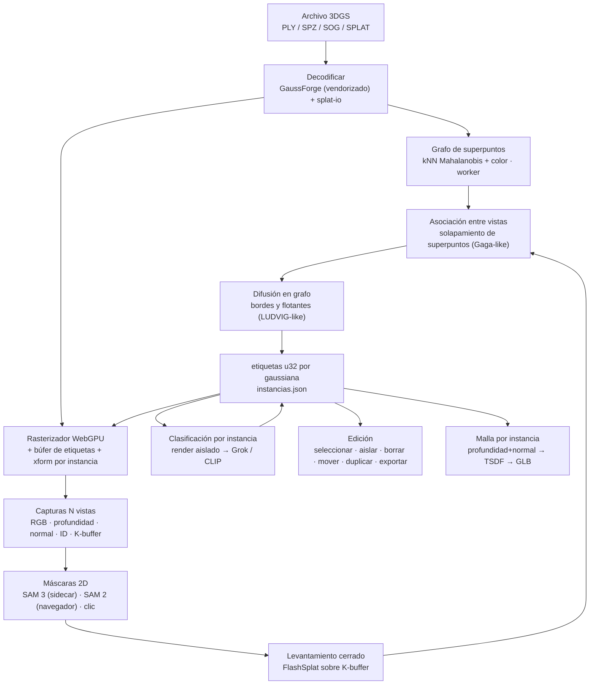

# Plan de alineación: clustering, segmentación, clasificación, malla y edición de objetos sobre 3DGS en el navegador

**Documento de planificación · rama `claude/gaussian-splat-plan-f0saqs`**
Gaussian Splatting Web Viewers · 2 de septiembre de 2026

Este documento evalúa el estado actual del repositorio, resume el estado del arte
verificado en 2025–2026 y propone un enfoque unificado, **sin entrenamiento por escena**,
para llevar el visor WebGPU desde "etiquetas sobre capturas" hasta un editor de objetos
3DGS con segmentación por gaussiana, clasificación por instancia, extracción de malla y
edición/exportación por objeto.

---

## 0. Resumen ejecutivo

**Diagnóstico.** El repositorio ya tiene lo más difícil: un rasterizador WebGPU fiel al
modelo de formación de imagen de Kerbl et al. (covarianza flotante, SH0–3, orden por
profundidad en GPU), decodificación multiformato con GaussForge y un sidecar local que
etiqueta capturas con Grok. Lo que falta es la **capa de identidad por gaussiana**: hoy
ninguna etiqueta vuelve a las gaussianas. Las cajas de Grok viven en 2D, el agrupamiento
entre vistas es por cadena de texto y no existe selección, máscara, edición ni exportación
por objeto.

**Enfoque propuesto: "renderizar → levantar → refinar en grafo → editar".** Todo el
razonamiento semántico se hace sobre imágenes compuestas por gaussianas conocidas bajo
cámaras conocidas (principio que el reporte actual ya adopta), y se cierra el ciclo con
tres piezas que la literatura 2024–2026 demuestra que no requieren entrenamiento:

1. **Pase de contribución por píxel (K-buffer) en WebGPU.** Para cada píxel se registra
   qué gaussianas contribuyen y con qué peso \(w_i = \alpha_i T_i\). Es la primitiva que
   habilita levantar cualquier máscara 2D a 3D de forma cerrada (FlashSplat, LUDVIG,
   Splat Feature Solver) y también el *picking* para selección.
2. **Grafo de superpuntos geométrico** (kNN sobre medias con distancia de Mahalanobis y
   color), calculado una sola vez por escena. Da un agrupamiento no supervisado inicial,
   limpia bordes y flotantes, y sirve de "banco de memoria 3D" para asociar máscaras entre
   vistas (idea de Gaga, sin optimizar rasgos por gaussiana).
3. **Etiquetas por gaussiana como búfer de GPU** (`u32` por gaussiana) que el shader usa
   para ocultar, aislar, teñir y transformar por instancia. Editar es operar sobre ese
   búfer y un registro de operaciones reproducible.

Con esa base, la clasificación abierta (Grok vision, CLIP), la generación de malla
(profundidad + normales renderizadas → fusión TSDF) y la exportación por objeto son
consumidores de la misma estructura de datos.

**Lo que no se propone.** No migrar a Spark ni a SuperSplat (WebGL2 sin cómputo; motor
completo, respectivamente), no entrenar campos de rasgos por escena en el navegador y no
sustituir el rasterizador por generadores de imagen (regla ya vigente en `docs/pipeline.md`).

---

## 1. Evaluación del repositorio actual

### 1.1 Inventario

| Componente | Estado | Reutilizable para el nuevo enfoque |
| --- | --- | --- |
| `gaussian_splatting_webgpu/gpu-renderer.js` | Rasterizador EWA + SH0–3, *counting sort* 16 bits en GPU, blending front-to-back | **Sí, núcleo.** Necesita búferes adicionales (etiquetas, transformaciones por instancia) y modos de salida (profundidad, normal, ID, contribución) |
| `gaussian_splatting_webgpu/parse-worker.js` + GaussForge | Decodifica PLY/SPLAT/SPZ/KSPLAT/SOG a `gaussians (N×12)` + `sh (N×48)` | **Sí.** GaussForge no transporta atributos extra; las etiquetas irán en un archivo lateral y en propiedades PLY propias |
| `gaussian_splatting_webgpu/main.js` | Cámara orbital, captura de vistas con pose, HUD, exportación | **Sí.** La captura con cámara es la base del pase de levantamiento y de la malla |
| `shared/splat-io.js` | Parser/escritor PLY y `.splat` propios | **Sí.** Punto natural para leer/escribir propiedades PLY extra (`instance_id`, `class_id`) y PLY de 2DGS |
| `semantic_sidecar/server.py` | Grok vision (cajas + nombres), Imagine (tarjetas), biblioteca `img_output/` | **Parcial.** Grok se mantiene para *nombrar*, no para *segmentar*; el sidecar crece con endpoints de máscaras, malla y embeddings |
| Visores WebGL (`gaussian_splatting_1`, `_2_three.js`, `_2_aframe`) | Heredados, 32/44 bytes por gaussiana | **No.** Se congelan como visores de compatibilidad |
| `splat_converter/` | PLY ↔ splat en navegador | Marginal; se reemplaza por exportación por objeto desde el visor |
| `docs/` | Reporte técnico, notas de operación, Chrome/Vulkan | Se extiende con este plan y su flujo |

### 1.2 Brechas frente al objetivo

| Capacidad pedida | Hoy | Brecha concreta |
| --- | --- | --- |
| Clustering de la nube | Nada | No hay estructura de vecindad ni superpuntos |
| Segmentación | Cajas 2D de Grok por captura | Sin máscaras 2D reales ni retro-proyección a gaussianas |
| Máscaras | Recortes de imagen | Sin máscara por gaussiana, sin *picking*, sin selección |
| Clasificación individual | Nombre por caja, fusión por texto | Sin instancias 3D; dos vistas de la misma silla son "dos sillas" si el nombre cambia |
| Renderizado por objeto | Escena completa | Sin aislar/ocultar/teñir por etiqueta |
| Malla | Nada | Sin salida de profundidad/normales ni fusión |
| Edición de objetos | Nada | Sin transformaciones por instancia, borrado ni exportación parcial |
| Datos | `img_output/` JSONL de tarjetas | Sin esquema de instancias, sin invariante de índice de gaussiana |

### 1.3 Riesgos técnicos ya presentes

- GaussForge se carga desde jsDelivr en tiempo de ejecución: sin red, sólo queda el parser propio (PLY/splat). Debe vendorizarse.
- El *sort* de 16 bits con un histograma por fotograma es correcto pero no expone índices por píxel; el pase de contribución debe diseñarse aparte (sección 3.2).
- No hay pruebas automatizadas más allá de `selftest.html`; el nuevo trabajo numérico (grafo, levantamiento, TSDF) necesita pruebas sintéticas.
- `plyToCloud` exige `scale_0..2`; los PLY de 2DGS (dos escalas) y de métodos de malla no cargan.

---

## 2. Estado del arte verificado (2024–2026) y qué tomar de cada línea

Se consultaron repositorios y páginas de proyecto (arXiv no era accesible desde este
entorno; las afirmaciones provienen de los README oficiales y del índice
*Awesome-3DGS-Applications*, TPAMI 2026).

### 2.1 Segmentación y levantamiento 2D→3D sin entrenamiento

| Método | Idea central | Requiere | Qué adoptamos |
| --- | --- | --- | --- |
| **FlashSplat** (NeurIPS 2024) | El render de una máscara es lineal en las etiquetas de las gaussianas; la asignación óptima es cerrada: etiqueta = argmax de la contribución \(\sum_p \alpha_i T_i\) acumulada por etiqueta, con sesgo de fondo para ruido | Rasterizador que devuelva pesos por píxel y por gaussiana | **La regla de asignación** y el sesgo de fondo. Es el consumidor directo del K-buffer |
| **LUDVIG** (ICCV 2025, NAVER) | "Render inverso": agregación ponderada por alfa de rasgos/máscaras 2D a gaussianas, seguida de difusión en grafo con similitud DINOv2 y geometría | Escena entrenada, cámaras, rasgos 2D | **La difusión en grafo** como refinamiento de bordes; opcional DINOv2 en sidecar |
| **Splat Feature Solver** (ICLR 2026, Apache-2.0) | Levantamiento como problema inverso lineal disperso resuelto en forma cerrada, con regularización de Tikhonov y agregación posterior | Igual que arriba | Referencia de calidad y herramienta *offline* (`splat-distiller`) para lotes con COLMAP |
| **THGS** (ACM MM 2025, CC BY-NC-SA) | Grafo de superpuntos sobre centroides, re-ponderado con pistas contrastivas de SAM; jerarquía objeto/parte sin entrenamiento | 2DGS entrenado, SAM, CLIP | **El grafo de superpuntos** como estructura base (re-implementado; la licencia impide vendorizar) |
| **Gaga** (TMLR 2026) | Asociación de máscaras SAM entre vistas mediante un banco de memoria 3D, en vez de identidad por texto o *tracking* | Gaussianas entrenadas, SAM | **La asociación por solapamiento 3D**, usando superpuntos como memoria |
| **PointGauss** (2025) | Decodificador de primitivas guiado por nube de puntos; máscaras de instancia en < 1 min y render 2D consistente | Segmentador de nube de puntos | Confirma la vía "primero geometría, luego semántica" |
| **Split&Splat** (2026) | Propaga máscaras entre vistas con profundidad, reconstruye cada instancia por separado y refina bordes | Reconstrucción por objeto | Propagación por profundidad como verificación cruzada |
| **OP2GS** (2026) | Sólo dos parámetros extra por primitiva: opacidad de instancia + etiqueta entera; evita campos de rasgos N-D | Entrenamiento | Valida el diseño "una etiqueta `u32` por gaussiana" como representación suficiente |
| Click-Gaussian, iSegMan, SAGA, Gaussian Grouping, OpenGaussian | Campos de rasgos por gaussiana optimizados por escena | Entrenamiento CUDA por escena | No se adoptan para el navegador; siguen siendo opción *offline* |

### 2.2 Modelos 2D de máscara y nombre

| Herramienta | Uso propuesto | Notas |
| --- | --- | --- |
| **SAM 3** (Meta, 848M, *SAM License*, pesos con acceso en HF) | Máscaras por concepto de texto ("silla", "maceta") y por punto/caja, en el sidecar | Es la fuente de máscaras de mayor calidad; la licencia permite uso amplio pero debe revisarse antes de distribuir |
| **SAM 2 en navegador** (ONNX Runtime Web + WebGPU; encoder > 100 MB, decoder ≈ 20 MB) | Máscaras por clic sin sidecar, modo *offline* | Probado en `webgpu-sam2`; entrada fija 1024², máscara 256² |
| **Grok 4.6 vision** (ya integrado) | Nombrar instancias a partir de un recorte renderizado sólo con las gaussianas de esa instancia | Grok responde VQA, no produce máscaras; se deja de usarlo como detector |
| **CLIP / DINOv2** (transformers.js con WebGPU, o sidecar) | Embedding por instancia para búsqueda por texto y para similitud entre superpuntos | Opcional en fase 4 |
| **SAM 3D Objects** (Meta, *SAM License*) | Reconstrucción generativa de un objeto (PLY de gaussianas o GLB) a partir de una imagen + máscara | Sólo como *fallback* generativo por instancia; no es medición de la escena |

### 2.3 Malla

| Método | Naturaleza | Aplicabilidad a un PLY ya entrenado |
| --- | --- | --- |
| **2DGS** (SIGGRAPH 2024) | Render de profundidad mediana + fusión TSDF (Open3D) | **Sí como receta**: funciona sobre cualquier rasterizador que produzca profundidad; con 3DGS vainilla la calidad es menor pero utilizable para objetos |
| **SuGaR** (CVPR 2024) | Muestreo de superficie + Poisson | Vía rápida para objetos aislados con normales de la gaussiana (eje menor de la covarianza) |
| **GOF** (2024) | Campo de opacidad + extracción tetraédrica | Alta calidad, pero CUDA y pensada para entrenamiento con regularización |
| **MILo** (2025) | Malla en el bucle de entrenamiento; un orden de magnitud menos vértices que GOF | **No aplica** a modelos ya entrenados; se recomienda como *pipeline* de entrenamiento cuando se necesite malla de producción |
| **NanoGS** (ECCV 2026, sin entrenamiento, CPU) | Fusión de pares en un grafo kNN por *moment matching* | Simplificación previa a la malla y misma estructura de grafo que nuestros superpuntos |

### 2.4 Herramientas web de referencia

| Herramienta | Licencia | Qué observar |
| --- | --- | --- |
| **SuperSplat** (PlayCanvas) | MIT | Herramientas de selección de referencia: rectángulo, pincel, lazo, polígono, esfera, caja, cuentagotas, relleno; mover/rotar/escalar; exporta PLY, PLY comprimido, SOG, splat, HTML de visor. Sin segmentación semántica |
| **Spark 2.0** (World Labs) | MIT | Múltiples objetos splat en una escena, edición por splat en GPU vía *shader graph*, LoD y *streaming*. WebGL2: sin cómputo, por eso no sirve como base del K-buffer |
| **gsplat** (nerfstudio) | Apache-2.0 | Referencia CUDA para render de rasgos N-D y profundidad; útil en el sidecar *offline* |

**Conclusión de la revisión.** La combinación "K-buffer en WebGPU + asignación cerrada de
FlashSplat + grafo de superpuntos + asociación 3D entre vistas" no existe como herramienta
web abierta. Cada pieza está validada por separado; el aporte del proyecto es integrarlas
sobre un rasterizador fiel y exponerlas como edición interactiva y exportación por objeto.

---

## 3. Enfoque propuesto

### 3.1 Arquitectura



### 3.2 Diseño técnico por módulo

#### A. Rasterizador (`gpu-renderer.js`)

- **Búfer de etiquetas** `labels: array<u32>` (N) y **búfer de instancias**
  `instances: array<Instance>` con `mat4 xform`, `vec4 tint`, `flags` (visible, seleccionada,
  aislada). El vertex shader lee `labels[index]`, aplica `xform` a la media y a la rotación
  (cuaternión de la matriz), y `tint`/`flags` a color y descarte. Coste: una lectura extra
  por instancia; sin cambio en el *sort*.
- **Modos de salida** (uniforme `output_mode`): 0 color; 1 profundidad (mediana según 2DGS:
  primer píxel con \(T < 0.5\)) escrita a `r32float`; 2 normal en espacio de cámara (eje de
  menor escala de la covarianza orientado hacia la cámara); 3 **ID** (índice de la primera
  gaussiana con \(\alpha \ge 0.5\), pase con prueba de profundidad y sin blending) para
  *picking* y selección.
- **Pase de contribución (K-buffer).** Nuevo `contrib-pass.js`: el fragment shader añade
  `(índice, alfa, profundidad)` a una lista por píxel de tamaño K (K = 16, resolución de
  levantamiento 512–768 px) mediante atómicos en un búfer de almacenamiento; un pase de
  cómputo ordena cada lista por profundidad, calcula \(T_i\) y \(w_i=\alpha_i T_i\) y acumula
  `contrib[i][etiqueta_del_pixel] += w_i` con `atomicAdd` sobre un búfer
  `N × L` (L etiquetas por lote, típicamente ≤ 64). Salida: matriz de contribuciones lista
  para la regla de FlashSplat. Alternativa de respaldo en CPU (worker) para escenas < 300k
  gaussianas.
- **Lectura de vuelta**: `readback(mode)` devuelve `Float32Array`/`Uint32Array` con la
  cámara usada (proyección, vista, focal), necesario para máscaras, TSDF y depuración.
- Compatibilidad: PLY de 2DGS (dos escalas → tercera escala = 1e-6) en `splat-io.js`.

#### B. Grafo de superpuntos (`shared/graph.js`, worker)

- kNN (k = 10) sobre medias con rejilla espacial (celda = mediana de la escala mayor).
- Peso de arista \(w_{ij}=\exp(-d_M^2/2)\cdot\exp(-\|c_i-c_j\|^2/\sigma_c^2)\) con \(d_M\)
  distancia de Mahalanobis simétrica usando ambas covarianzas y \(c\) el color SH0.
- Corte de aristas bajo umbral y componentes conexas → superpuntos (objetivo 2k–50k).
  Segunda pasada opcional tipo Felzenszwalb para nivel "parte".
- Salida: `superpoint: Uint32Array(N)`, lista de adyacencia CSR, centroides y tamaño.
- Uso: (1) agrupamiento no supervisado inicial (vista "Grupos"), (2) memoria 3D para
  asociar máscaras, (3) difusión de etiquetas, (4) base para simplificación tipo NanoGS.

#### C. Levantamiento y asociación (`shared/lift.js`)

- Para cada vista capturada y cada máscara: contribución acumulada por gaussiana.
- Regla FlashSplat: `label_i = argmax_l C[i][l]` con sesgo de fondo \(\gamma\) (por defecto
  0,3 de la masa total) y umbral mínimo de masa para ignorar gaussianas apenas vistas.
- **Asociación entre vistas**: cada máscara levantada se describe por el multiconjunto de
  superpuntos que cubre (ponderado por masa). Dos máscaras de vistas distintas son la misma
  instancia si su IoU de superpuntos supera 0,5; se resuelve con asignación húngara por
  pareja de vistas y unión-búsqueda global. Esto sustituye la fusión por nombre de
  `cluster_objects` en el sidecar.
- **Difusión en grafo**: 3–10 iteraciones de propagación de etiquetas por mayoría
  ponderada en las aristas del grafo; limpia bordes y flotantes. Opcional: similitud
  DINOv2 por superpunto (sidecar) para reponderar aristas (LUDVIG).

#### D. Clasificación por instancia (`semantic_sidecar` + navegador)

- Por instancia: render aislado (sólo sus gaussianas, fondo transparente) desde 1–3
  cámaras que maximizan su área proyectada → recorte → **Grok vision** devuelve
  `{nombre, nombre_es, categoria, confianza}`; **CLIP** (opcional) devuelve un embedding
  para búsqueda por texto.
- Se mantiene la tarjeta Imagine como ilustración, ahora ligada a `id_instancia` y con el
  recorte aislado como fuente.

#### E. Selección y edición (`gaussian_splatting_webgpu/select.js`, `edit-ops.js`)

- Selección con el búfer ID y centros proyectados: clic (instancia), rectángulo, lazo,
  pincel (radio en píxeles), esfera 3D y "por grupo" (superpunto); modificadores
  añadir/quitar/intersecar. Referencia de UX: SuperSplat.
- Operaciones sobre el búfer de etiquetas y el registro de instancias: aislar, ocultar,
  borrar, fusionar, dividir por superpuntos, renombrar, teñir, mover/rotar/escalar
  (rígida por instancia en GPU), duplicar (copia de gaussianas con nueva etiqueta).
- **Registro de operaciones** (`ops.jsonl`) reproducible y con deshacer/rehacer; "aplicar"
  hornea las transformaciones en `gaussians` para exportar.
- Exportación: por instancia o escena vía GaussForge (PLY/SPZ/SOG/…) más `instancias.json`;
  PLY propio con propiedades extra (`instance_id`, `class_id`, `confidence`).
- Fuera de alcance en v1: relleno de agujeros tras borrar (GPGS, GaussianEditor requieren
  difusión 2D y reoptimización; se deja como etapa *offline* opcional).

#### F. Malla por instancia (`semantic_sidecar/mesh.py` y `shared/tsdf.js` más adelante)

- Órbita de 24–48 cámaras alrededor de la instancia aislada → profundidad mediana +
  normal + RGB + cámara.
- Fusión TSDF (Open3D `ScalableTSDFVolume`, receta 2DGS) → *marching cubes* → limpieza
  (componente mayor, decimación) → GLB con color por vértice. Vía rápida: Poisson sobre
  medias con normales de la covarianza para objetos pequeños.
- Advertencia de calidad: con 3DGS vainilla la superficie es ruidosa; el visor debe avisar
  y recomendar PLY de 2DGS/GOF/MILo para malla de producción. `SAM 3D Objects` queda como
  reconstrucción generativa alternativa (marcada como tal en los metadatos).

### 3.3 Esquema de datos (invariante: índice de gaussiana)

El índice de la gaussiana en el archivo fuente es el identificador invariante; toda
etiqueta, selección y exportación se expresa sobre él. Nunca se reordena la nube sin
conservar `indice_original`.

```text
artifacts/
  segmentaciones/<escena>/<AAAA-MM-DD_HHMM>/
    etiquetas.u32          # N × uint32, instancia por gaussiana (0 = fondo)
    superpuntos.u32        # N × uint32
    instancias.json        # metadatos (abajo)
    ops.jsonl              # registro de edición reproducible
    vistas/                # capturas usadas para levantar (PNG + cámara)
  mallas/<escena>/<id_instancia>.glb
  exportaciones/<escena>/<id_instancia>.<ply|spz|sog>
```

`instancias.json` (mínimo):

```json
{
  "escena": "model.splat",
  "fecha": "2026-09-02T18:40:00Z",
  "fuente": {"formato": "splat", "n_gaussianas": 401231, "sh_grado": 0, "hash": "…"},
  "metodo": {"mascaras": "sam3", "levantamiento": "flashsplat", "sesgo_fondo": 0.3, "difusion_iter": 5},
  "instancias": [
    {
      "id_instancia": 3,
      "nombre": "office chair",
      "nombre_es": "silla de oficina",
      "categoria": "mobiliario",
      "confianza": 0.91,
      "n_gaussianas": 18240,
      "bbox": {"min": [..], "max": [..]},
      "color": [126, 224, 200],
      "vistas": [0, 2, 3],
      "malla": "mallas/model/3.glb",
      "embedding_clip": "instancias/3.clip.f16"
    }
  ]
}
```

Reglas: la UI y los reportes usan `nombre_es`; los archivos generados van siempre a
`artifacts/` (o `img_output/` para tarjetas), nunca a la raíz; todo JSON se valida contra
un esquema (`shared/schemas/instancias.schema.json`).

---

## 4. Plan por fases

> **Estado (2 sep 2026):** F0, F1, F2 y F3 (primer incremento) implementados en la rama `claude/gaussian-splat-plan-f0saqs`: GaussForge vendorizado (probado con el CDN bloqueado), PLY 2DGS, `artifacts/`, `npm test` (79 pruebas) y `npm run test:e2e` (16 pruebas, Chromium + SwiftShader, render *offscreen*), búfer de etiquetas + tabla de instancias + modos ID/profundidad/normal + `renderOffscreen()`/`pick()` en `gpu-renderer.js`, panel **Instancias** en el HUD y escena sintética de dos esferas con profundidad verificada al 0,0 %. El modo profundidad de `renderOffscreen` sigue siendo la media ponderada por alfa; la mediana 2DGS exacta la devuelve `renderContributions().medianDepth` (K-buffer). Ver `docs/testing.md`. **F2:** `shared/graph.js` + `graph-worker.js` (kNN k=10 con rejilla hash ordenada por celda, pesos Mahalanobis simétricos × color SH0, umbral, componentes conexas → superpuntos, difusión por mayoría ponderada), panel **Grupos**, modo de color «Grupos» con búfer `groups` propio (no consume la tabla de 4096 instancias) y clic → grupo a instancia; dos esferas sintéticas → exactamente 2 grupos; 1 M gaussianas ≈ 4–5 s en un contenedor de 4 vCPU sin GPU (`scripts/bench-graph.mjs`), pendiente de medir en portátil. No hecho de F2: segunda pasada tipo Felzenszwalb (nivel «parte»). **F3:** `contrib-pass.js` (K-buffer exacto: lista ordenada por profundidad dibujada en trozos que se dividen si algún píxel supera K = 16, T por píxel persistente, masa α·T por etiqueta en punto fijo con lotes de columnas ≤ 64 MB), `shared/lift.js` (argmax FlashSplat con sesgo de fondo, asociación tipo Gaga por contención de histogramas de superpuntos, exportación `instancias.json`/`etiquetas.u32`), panel **Segmentación** (fuentes: etiquetas actuales, sidecar cajas Grok → elipses, sidecar SAM vía `SAM_BACKEND`), sidecar `/segment` y `/segmentaciones`. Aceptación sintética: 6 vistas con ids permutados → 2 instancias, IoU 3D 0,9985/1,0 y 1,0/1,0 tras difusión. Pendiente de F3: SAM 2 en el navegador (ONNX), verificación sobre `model.splat` con máscaras reales (misma silla = una instancia), embeddings CLIP.

| Fase | Entregable | Criterio de aceptación | Esfuerzo |
| --- | --- | --- | --- |
| **F0 Base** | GaussForge vendorizado; PLY 2DGS; `artifacts/`; pruebas Node para `splat-io`; Playwright con Chromium WebGPU para `selftest` | Carga sin red; `npm test` verde | 1 semana |
| **F1 Identidad** | Búfer de etiquetas + instancias en el shader; modos ID/profundidad/normal; `readback`; clic selecciona instancia; ocultar/aislar/teñir | Escena sintética de dos esferas: clic en cada una devuelve su etiqueta; profundidad vs. valor analítico < 1 % | 2 semanas |
| **F2 Grafo** | `shared/graph.js` en worker: kNN, superpuntos, difusión; vista "Grupos" coloreada; selección por grupo | Dos blobs separados → 2 componentes; tiempo < 3 s para 1 M gaussianas en portátil | 2 semanas |
| **F3 Levantar** | K-buffer WebGPU; asignación FlashSplat; endpoint `/segment` (SAM 3) en sidecar y SAM 2 en navegador; asociación por superpuntos entre vistas; `instancias.json` + `etiquetas.u32` | Máscara sintética conocida → IoU 3D > 0,9; en `model.splat`, 4 vistas producen instancias consistentes (misma silla = una instancia) | 3 semanas |
| **F4 Nombrar** | Render aislado por instancia; `/name` (Grok) con `nombre_es`; CLIP opcional; tarjetas Imagine ligadas a `id_instancia`; panel de instancias en español | Cada instancia tiene nombre, categoría y confianza; búsqueda por texto resalta la instancia | 1–2 semanas |
| **F5 Editar/Exportar** | Rectángulo/lazo/pincel/esfera; mover/rotar/escalar/duplicar/borrar/fusionar/dividir; `ops.jsonl` con deshacer; exportar instancia o escena (GaussForge + PLY con extras) | Exportar una instancia y recargarla muestra sólo ese objeto; reproducir `ops.jsonl` da el mismo resultado | 2–3 semanas |
| **F6 Malla** | Órbita + profundidad/normal → `/mesh` (Open3D TSDF) → GLB; vista previa en el visor; vía Poisson | Objeto de prueba: distancia de Chamfer contra malla de referencia dentro del margen documentado; GLB abre en Blender | 2 semanas |
| **F7 Documentar** | Actualizar `docs/pipeline.md`, reporte técnico (nuevas etapas, licencias), README | Diagrama y tablas de licencias al día | 1 semana |

Orden recomendado: F0 → F1 → F2 → F3 → F5 → F4 → F6 → F7. La edición (F5) antes del
nombrado (F4) porque la selección manual ya produce valor sin sidecar.

### Hitos visibles

- **H1 (fin F1):** clic sobre un objeto lo aísla y lo tiñe; el HUD muestra "instancia n".
- **H2 (fin F3):** botón "Segmentar escena" produce instancias 3D consistentes entre vistas.
- **H3 (fin F5):** mover una silla y exportarla como `.spz` propio.
- **H4 (fin F6):** "Malla" en una instancia descarga un `.glb`.

---

## 5. Cambios de estructura del repositorio

```text
gaussian_splatting_webgpu/   visor: renderer, contrib-pass, select, edit-ops, HUD
shared/                      splat-io, graph, lift, segments-io, schemas/
semantic_sidecar/            server.py (+ segment.py, name.py, mesh.py, embed.py)
scripts/                     herramientas de un solo uso (lote COLMAP → splat-distiller, conversión de datasets)
artifacts/                   salidas generadas (gitignored salvo README)
vendor/                      @gaussforge/wasm versionado en git (1,4 MB, un solo archivo; F0 exige carga sin red) + scripts/vendor-gaussforge.sh; modelos ONNX grandes gitignored con script de descarga
docs/                        este plan, pipeline, reporte
```

Convenciones: funciones pequeñas con validación de esquemas y *logging* claro; UI y
reportes en español; los visores WebGL quedan sin cambios.

---

## 6. Riesgos y mitigaciones

| Riesgo | Impacto | Mitigación |
| --- | --- | --- |
| Atómicos y K-buffer en WebGPU con escenas > 2 M gaussianas | Memoria `N × L × 4` bytes y contención | Levantar por lotes de etiquetas (L ≤ 64), resolución 512–768, y respaldo en CPU |
| Calidad de máscaras SAM sobre renders borrosos de `.splat` compactos | Instancias fragmentadas | Priorizar PLY entrenados (SH3); difusión en grafo; *zoom* automático a la instancia |
| Licencias: THGS es CC BY-NC-SA, SAM 3 / SAM 3D usan *SAM License*, MILo licencia INRIA | Distribución | Re-implementar ideas (no código) en MIT; SAM sólo como servicio local; documentar en la tabla del reporte |
| Grok no devuelve máscaras y sus cajas varían entre vistas | Ya observado | Grok pasa a nombrar recortes aislados; la geometría decide la identidad |
| Malla pobre desde 3DGS vainilla | Expectativas | Aviso en la UI; recomendar 2DGS/MILo; Poisson para objetos |
| Vendorizar modelos ONNX de cientos de MB | Tamaño del repo | `vendor/` gitignored con script de descarga y caché OPFS en el navegador |
| Sin pruebas | Regresiones numéricas | Escenas sintéticas y `npm test` desde F0 |

---

## 7. Decisiones descartadas

- **Migrar a Spark o SuperSplat.** Ambos son MIT y maduros, pero Spark es WebGL2 (sin
  cómputo para el K-buffer) y SuperSplat es una aplicación completa sobre PlayCanvas; el
  costo de integrar el rasterizador fiel y el sidecar supera el beneficio. Se toman sus
  patrones de UX y sus escritores de formato como referencia.
- **Campos de rasgos por gaussiana entrenados en el navegador.** Requieren
  retro-propagación por escena; la evidencia de 2025–2026 muestra que el levantamiento
  cerrado alcanza calidad comparable en minutos.
- **Usar generadores de imagen como fuente de máscaras o de vistas.** Sin cámara ni
  opacidad no hay correspondencia con gaussianas (regla vigente en `docs/pipeline.md`).

---

## 8. Referencias consultadas

- Awesome-3DGS-Applications (índice del survey TPAMI 2026): https://github.com/heshuting555/Awesome-3DGS-Applications
- FlashSplat: https://github.com/florinshen/FlashSplat
- LUDVIG (ICCV 2025): https://github.com/naver/ludvig
- Splat Feature Solver / splat-distiller (ICLR 2026): https://github.com/saliteta/splat-distiller
- THGS (ACM MM 2025): https://github.com/Atrovast/THGS
- Gaga (TMLR 2026): https://github.com/weijielyu/Gaga
- Segment then Splat (NeurIPS 2025): https://papers.nips.cc/paper_files/paper/2025/hash/f2644105c6680950b0adbfa0a2cfb177-Abstract-Conference.html
- Click-Gaussian (ECCV 2024): https://seokhunchoi.github.io/Click-Gaussian/
- PointGauss (2025), Split&Splat (2026), OP2GS (2026), NG-GS (2026): entradas del índice anterior
- NanoGS (ECCV 2026): https://github.com/saliteta/NanoGS
- SAM 3: https://github.com/facebookresearch/sam3 · SAM 3D Objects: https://github.com/facebookresearch/sam-3d-objects
- SAM 2 en navegador con WebGPU: https://github.com/lucasgelfond/webgpu-sam2
- Transformers.js (SAM, SAM 2, CLIP, DINOv2 con `device: "webgpu"`): https://github.com/huggingface/transformers.js
- 2DGS y fusión TSDF: https://github.com/hbb1/2d-gaussian-splatting · SuGaR: https://anttwo.github.io/sugar/ · MILo: https://github.com/Anttwo/MILo
- SuperSplat (MIT): https://github.com/playcanvas/supersplat · Spark 2.0 (MIT): https://github.com/sparkjsdev/spark · World Labs sobre Spark 2.0: https://www.worldlabs.ai/blog/spark-2.0
- GaussForge (Apache-2.0): https://github.com/3dgscloud/GaussForge
- gsplat: https://docs.gsplat.studio/main/
